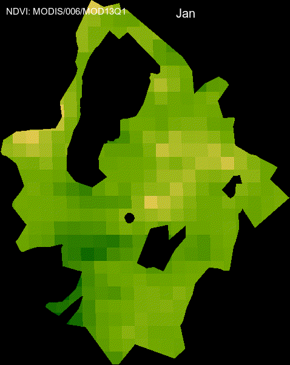

```{r include=FALSE}
knitr::opts_chunk$set(message=FALSE, warning=FALSE)
```


```{r}
#Cargar los paquetes a utilizar
library(tidyverse)
library(sf)
library(raster)
library(here)
library(DiagrammeR)
```

## Prepara datos espaciales 

- El polígono que delimita la zona de pastos se ha creado en base a la localización del ganado (mediante GPSs)

- Creamos un bbox de esa capa lo llamamos `aoi` (Area of Interest)

```{r get_aoi}
pastos <- st_read(dsn = here::here("data/spatial/02_PASTOS_ADYACENTES/Pastos_adyacentes.shp"),
               quiet = TRUE)
aoi <- st_as_sfc(st_bbox(pastos))
```


```{r init-gee, echo=FALSE, message=FALSE}
library(rgee)
# datos sensibles
ee_Initialize(email="ajperez@go.ugr.es", quiet=TRUE)
```

```{r prepare-aoi}
ee_aoi <- aoi %>% 
  sf_as_ee()

ee_aoi <- pastos %>% sf_as_ee()
```


```{r process-modis}
modis_ndvi <- ee$ImageCollection("MODIS/006/MOD13Q1")


# Filter out poor quality pixels
getQABits <- function(image, qa) {
  # Convert binary (character) to decimal (little endian)
  qa <- sum(2^(which(rev(unlist(strsplit(as.character(qa), "")) == 1))-1))
  # Return a mask band image, giving the qa value.
  image$bitwiseAnd(qa)$lt(1)
}


# Using getQABits we construct a single-argument function 'mod13A2_clean'
mod13q1_clean <- function(img) {
  # Extract the NDVI band
  ndvi_values <- img$select("NDVI")
  
  # Extract the quality band
  ndvi_qa <- img$select("SummaryQA")

  # Select pixels to mask
  quality_mask <- getQABits(ndvi_qa, "11")

  # Mask pixels with value zero.
  ndvi_values$updateMask(quality_mask)
}


# Create a monthly composite
ndvi_composite <- modis_ndvi$
  filter(ee$Filter$date('2001-01-01', '2020-12-31'))$
  filter(ee$Filter$calendarRange(1, field = "month"))$
  map(mod13q1_clean)$
  median()


# Display results
scale <- 0.0001
Map$setCenter(lon = -2.6,lat = 37.32,zoom = 10)
Map$addLayer(
  eeObject = ndvi_composite,
  visParams = list(
  min = 0.0 / scale,
  max = 9000.0,
  bands = "NDVI",
  palette = c(
    'FFFFFF', 'CE7E45', 'DF923D', 'F1B555', 'FCD163', '99B718', '74A901',
    '66A000', '529400', '3E8601', '207401', '056201', '004C00', '023B01',
    '012E01', '011D01', '011301'
  )
))+ Map$addLayer(ee_aoi)

```


```{r, eval=FALSE}
col <- ee$ImageCollection("MODIS/006/MOD13Q1")$select('NDVI')

region <- ee_aoi$bounds()


col <- col$map(function(img) {
  doy <- ee$Date(img$get('system:time_start'))$getRelative('day', 'year')
  img$set('doy', doy)
})
distinctDOY <- col$filterDate('2019-01-01', '2020-01-01')

filter <- ee$Filter$equals(leftField = 'doy', rightField = 'doy')

join <- ee$Join$saveAll('doy_matches')
joinCol <- ee$ImageCollection(join$apply(distinctDOY, col, filter))

comp <- joinCol$map(function(img) {
  doyCol = ee$ImageCollection$fromImages(
    img$get('doy_matches')
  )
  doyCol$reduce(ee$Reducer$median())
})

visParams = list(
  min = 0.0,
  max = 9000.0,
  bands = "NDVI",
  palette = c(
    'FFFFFF', 'CE7E45', 'DF923D', 'F1B555', 'FCD163', '99B718', '74A901',
    '66A000', '529400', '3E8601', '207401', '056201', '004C00', '023B01',
    '012E01', '011D01', '011301'
  )
)


rgbVis <- comp$map(function(img) {
  do.call(img$visualize, visParams) %>% 
    ee$Image$clip(ee_aoi)
})


gifParams <- list(
  region = region,
  dimensions = 600,
  crs = 'EPSG:3857',
  framesPerSecond = 1.5
)

dates_modis_mabbr <- distinctDOY %>% 
  ee_get_date_ic %>% # Get Image Collection dates
  '[['("time_start") %>% # Select time_start column
  lubridate::month() %>% # Get the month component of the datetime
  '['(month.abb, .) # subset around month abbreviations

animation <- ee_utils_gif_creator(rgbVis, gifParams, mode = "wb")
animation_wtxt <- 
  animation %>% 
  ee_utils_gif_annotate(
    text = "NDVI: MODIS/006/MOD13Q1",
    size = 15, color = "white",
    location = "+10+10"
  ) %>% 
  ee_utils_gif_annotate(
    text = dates_modis_mabbr, 
    size = 20, 
    location = "+290+10",
    color = "white", 
    font = "arial",
    boxcolor = "#000000"
  ) 

ee_utils_gif_save(animation_wtxt, path =here::here("docs/output/ndvi_alcontar.gif"))
```


{width=70%}


